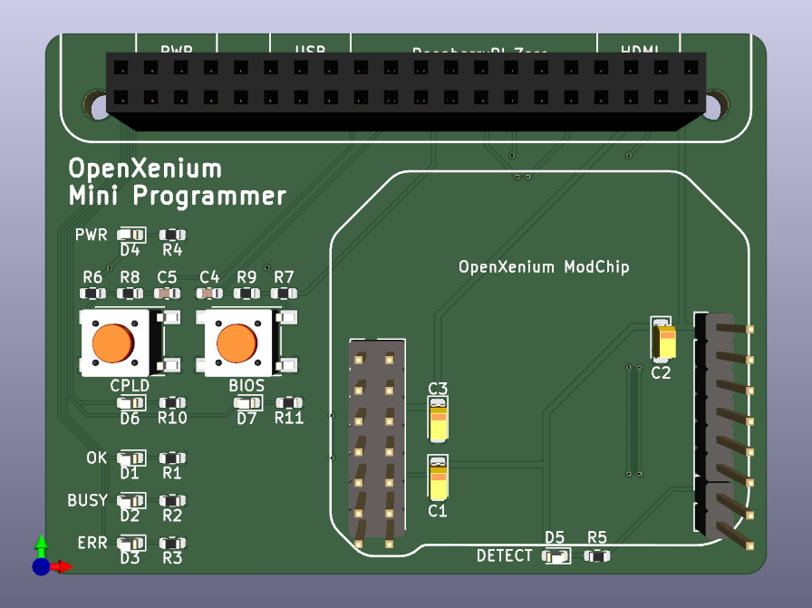
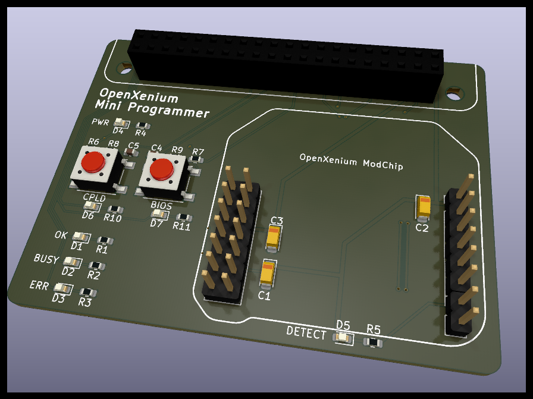

# OpenXenium JTAG and Flash Memory programmer
New smaller size board is less wasteful and has on-board buttons that actually work with the new script!
LEDs are connected to different GPIOs than the original board, so the old script will not work properly.
Plug the RPI and the OpenXenium modchip into their respective headers, and run the new script.

### Raspberry PI:
- This has only been tested on PI Zero W so far.

-------------
## INSTALLING THE XENIUM PROGRAMMER

On the PI:
- Clone this repo by running: `git clone https://github.com/captmicr0/xenium-programmer`
- Then run: `./install`

## UPDATING XENIUM PROGRAMMER

On the PI:
- Pull the latest code with: `git pull`
- Then run: `./install` 

-------------
## PROGRAMMING A XENIUM CPLD AND FLASH MEMORY

- Connect to the PI or Omega via SSH or Serial terminal
- Run: `./xenium-programmer-small`
- On the board, press the BIOS button to write a new BIOS to the OpenXenium flash chip
- On the board, press the CPLD button to program the Xilinx CPLD on the OpenXenium.

Note: Pressing the BIOS button will flash a program onto the CPLD that allows you to
write to the flash chip. This overwrites the OpenXenium firmware, so you must re-program
the CPLD afterwards by pressing the CPLD button.

### SMALL PC BOARD

-------------
## CREDITS

- Koos du Preez - Creator (kdupreez@hotmail.com - Comments, improvements, critique, etc. is welcome!)
- James Bolding - Kick ass awesome hardware design and PCB!
- captmicr0 - Smaller board design and modified script for it.
- Ryzee119 -  OpenXenium Firmware and hardware and all round awesomeness!
- XC3SPROG - Not sure who to thank here, but the source code was pivotal in making this work!
